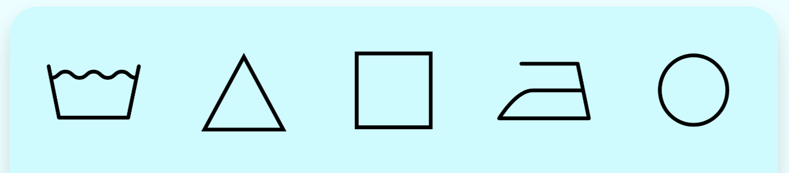
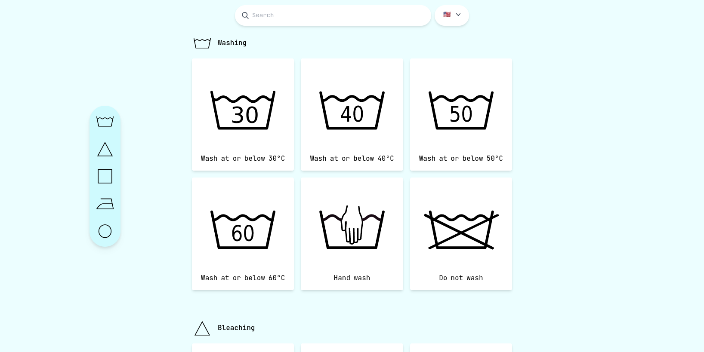

<h1>laundry-symbols</h1>
<h2>A list to help understand those symbols found inside our clothes</h2>

[**laundry-symbols**](https://laundry-symbols.vercel.app/) is a page, built with Astro, Tailwind and Typescript, that lists most of the so called [_laundry symbols_](https://en.wikipedia.org/wiki/Laundry_symbol) found on every clothing, indicating the manufacturer's suggestions as to **methods of washing, drying, dry-cleaning and ironing clothing**.

    

## 🌎 Available Languages

The website is currently available in 2 languages:

| Language             | Url                                                   |
| :------------------- | :---------------------------------------------------- |
| English              | `/` or [`/en`](https://laundry-symbols.vercel.app/en) |
| Brasilian Portuguese | [`/pt-br`](https://laundry-symbols.vercel.app/pt-br)  |

## 🧞 Running the Project

All commands are run from the root of the project, from a terminal:

| Command                | Action                                           |
| :--------------------- | :----------------------------------------------- |
| `npm install`          | Installs dependencies                            |
| `npm run dev`          | Starts local dev server at `localhost:4321`      |
| `npm run build`        | Build your production site to `./dist/`          |
| `npm run preview`      | Preview your build locally, before deploying     |
| `npm run astro ...`    | Run CLI commands like `astro add`, `astro check` |
| `npm run astro --help` | Get help using the Astro CLI                     |
